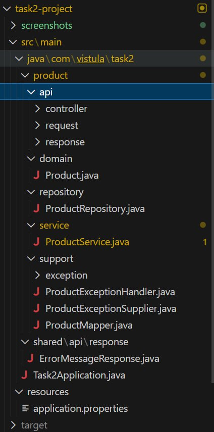
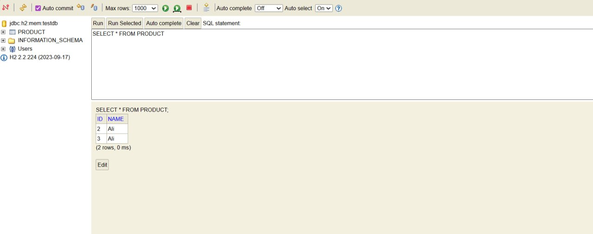

# Spring Boot REST API - Product Management

## Description

REST API for product management. Simple application with H2 database demonstrating all basic CRUD operations.

## Technologies

- Java 17+
- Spring Boot 3.x
- Spring Data JPA
- H2 Database
- Maven
- Swagger UI

## How to Run

1. Run Task2Application.java
2. Application starts on http://localhost:8080

## Project Structure

product/
├── api/
│   ├── controller/ProductController.java
│   ├── request/ProductRequest.java
│   └── response/ProductResponse.java
├── domain/Product.java (Entity)
├── repository/ProductRepository.java
├── service/ProductService.java
└── support/
    ├── ProductMapper.java
    ├── ProductExceptionHandler.java
    └── exception/ProductNotFoundException.java

## Useful Links

- Swagger UI: http://localhost:8080/swagger-ui/index.html
- H2 Console: http://localhost:8080/console
  - JDBC URL: jdbc:h2:mem:testdb
  - Username: sa
  - Password: (empty)

---

## API Endpoints

### 1. Create Product

POST /api/v1/products

Creates a new product in the database.

Request:
{
  "name": "Ali",
  "email": "Ali@mail.com"
}

Response: 201 Created
{
  "id": 1,
  "name": "Ali"
}

Swagger UI:

.png)

.png)

---

### 2. Get All Products

GET /api/v1/products

Retrieves all products from the database.

Response: 200 OK
[
  {
    "id": 1,
    "name": "Ali"
  }
]

Swagger UI:

.png)

---

### 3. Update Product

PUT /api/v1/products/{id}

Updates an existing product by ID.

Request:
{
  "name": "Ali Updated"
}

Response: 200 OK
{
  "id": 1,
  "name": "Ali Updated"
}

Swagger UI:

.png)

.png)

---

### 4. Delete Product

DELETE /api/v1/products/{id}

Deletes a product by ID.

Response: 204 No Content

Swagger UI:

.png)

.png)

---

## Error Handling

When trying to get/update/delete a non-existent product:

Response: 404 Not Found
{
  "message": "Product with id: 999 not found"
}

---

## Testing via Swagger

1. Open http://localhost:8080/swagger-ui/index.html
2. Select the desired endpoint
3. Click "Try it out"
4. Enter data and click "Execute"

All endpoints are documented and can be tested interactively through Swagger UI.

---

## Database Verification

### H2 Console Access

1. Open http://localhost:8080/console
2. Enter connection details:
   - JDBC URL: jdbc:h2:mem:testdb
   - Username: sa
   - Password: (leave empty)
3. Click "Connect"

### SQL Queries

View all products:
SELECT * FROM PRODUCT;

Check table structure:
SHOW COLUMNS FROM PRODUCT;

---

## Main Components

### Product (Entity)
Data model for database
@Entity
public class Product {
    @Id
    @GeneratedValue(strategy = GenerationType.IDENTITY)
    private Long id;
    private String name;
}

### ProductRepository
Database operations - extends JpaRepository for automatic CRUD methods
public interface ProductRepository extends JpaRepository<Product, Long> {
}

### ProductService
Business logic layer - handles data processing
@Service
public class ProductService {
}

### ProductController
REST API endpoints - handles HTTP requests and responses
@RestController
@RequestMapping("/api/v1/products")
public class ProductController {
}

### ProductMapper
Conversion between DTO and Entity objects
@Component
public class ProductMapper {
}

### ProductExceptionHandler
Global error handling for all controllers
@ControllerAdvice
public class ProductExceptionHandler {
}
